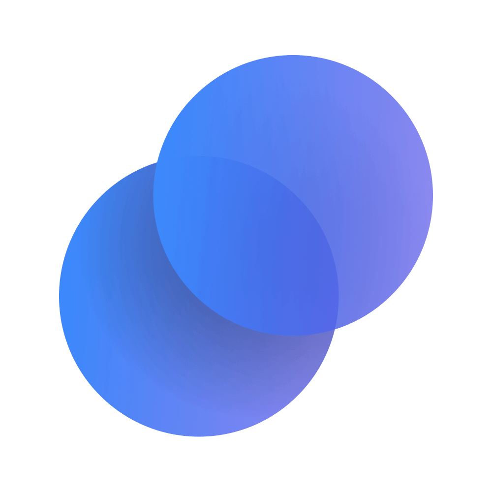

# [ Paradigm.co](https://www.paradigm.co/)

Paradigm was born out of our own frustrations with the institutional OTC trading process.

After spending hundreds of hours trading and navigating the inefficient, multi-channel nature of traditional OTC markets, we thought to ourselves: there has to be a better way.

Paradigm automates bilateral price negotiation and settlement workflows for
institutional digital asset traders. We are building the next generation of institutional OTC trading that is powered by conversation and automated with AI.

## [Public API](./api)

*Documentation: https://docs.paradigm.co/*

This area houses a collection of python scripts to connect over HTTP and websocket connections to the Paradigm platform.

Paradigm exposes a public API to interact with the platform's RFQ (Request for
Quote) engine to create, quote, and execute on them with multiple counterparties.
